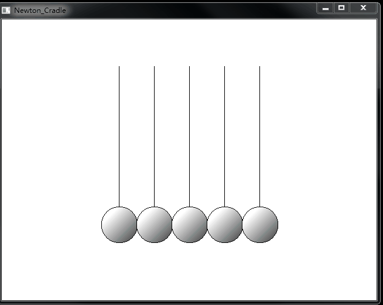
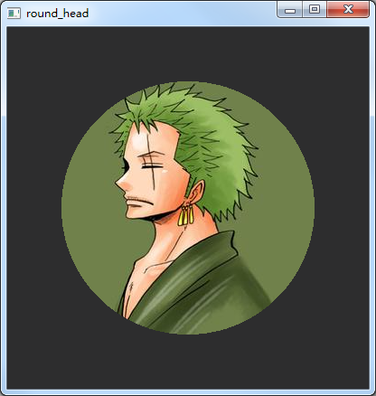

# 一些用QT写的小程序

### Newton_Cradle
一个模拟牛顿摆的小程序

### position

《Qt5开发及实例》第六章第一节：Qt5位置相关函数中的例程

### paint

《Qt5开发及实例》第六章第二节：Qt5基础图形的绘制中的例程

### round_head
QT widget实现圆形头像

原图是这样的：

画成圆形头像是这样的：

### speed_meter
